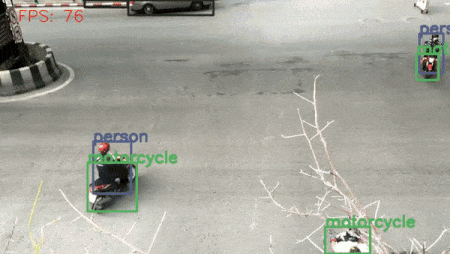

# vision_transformers

***A repository for everything Vision Transformers.***



## Currently Supported Models

- Image Classification

  - ViT Base Patch 16 | 224x224: Torchvision pretrained weights
  - ViT Base Patch 32 | 224x224: Torchvision pretrained weights
  - ViT Tiny Patch 16 | 224x224: Timm pretrained weights
  - Vit Tiny Patch 16 | 384x384: Timm pretrained weights
  - Swin Transformer Tiny Patch 4 Window 7 | 224x224: Official Microsoft weights
  - Swin Transformer Small Patch 4 Window 7 | 224x224: Official Microsoft weights
  - Swin Transformer Base Patch 4 Window 7 | 224x224: Official Microsoft weights
  - Swin Transformer Large Patch 4 Window 7 | 224x224: No pretrained weights
  - MobileViT S
  - MobileViT XS
  - MobileVit XXS
- Object Detection
  - DETR ResNet50 (COCO pretrained)
  - DETR ResNet50 DC5 (COCO pretrained)
  - DETR ResNet101 (COCO pretrained)
  - DETR ResNet101 DC5 (COCO pretrained)

## GO TO

* [Quick Setup](#Quick-Setup)
* [Importing Models and Usage](#Importing-Models-and-Usage)
* [DETR Video Inference Commands (COCO pretrained models)](#DETR-Video-Inference-Commands-(COCO-pretrained-models))
* [Examples](#Examples)


## Quick Setup

### Stable PyPi Package

```bash
pip install vision-transformers
```

### OR

### Latest Git Updates

```bash
git clone https://github.com/sovit-123/vision_transformers.git
cd vision_transformers
```

Installation in the environment of your choice:

```bash
pip install .
```

## Importing Models and Usage

### If you have you own training pipeline and just want the model

**Replace `num_classes=1000`** **with you own number of classes**.

```python
from vision_transformers.models import vit

model = vit.vit_b_p16_224(num_classes=1000, pretrained=True)
# model = vit.vit_b_p32_224(num_classes=1000, pretrained=True)
# model = vit.vit_ti_p16_224(num_classes=1000, pretrained=True)
```

```python
from vision_transformers.models import swin_transformer

model = swin_transformer.swin_t_p4_w7_224(num_classes=1000, pretrained=True)
# model = swin_transformer.swin_s_p4_w7_224(num_classes=1000, pretrained=True)
# model = swin_transformer.swin_b_p4_w7_224(num_classes=1000, pretrained=True)
# model = swin_transformer.swin_l_p4_w7_224(num_classes=1000)
```

### If you want to use the training pipeline

* Clone the repository:

```bash
git clone https://github.com/sovit-123/vision_transformers.git
cd vision_transformers
```

* Install

```bash
pip install .
```

From the `vision_transformers` directory:

* If you have no validation split

```bash
python tools/train_classifier.py --data data/diabetic_retinopathy/colored_images/ 0.15 --epochs 5 --model vit_ti_p16_224
```

* In the above command:

  * `data/diabetic_retinopathy/colored_images/` represents the data folder where the images will be inside the respective class folders

  * `0.15` represents the validation split as the dataset does not contain a validation folder

* If you have validation split

```bash
python tools/train_classifier.py --train-dir data/plant_disease_recognition/train/ --valid-dir data/plant_disease_recognition/valid/ --epochs 5 --model vit_ti_p16_224
```

* In the above command:
  * `--train-dir` should be path to the training directory where the images will be inside their respective class folders.
  * `--valid-dir` should be path to the validation directory where the images will be inside their respective class folders.

### All Available Model Flags for `--model`

```
vit_b_p32_224
vit_ti_p16_224
vit_ti_p16_384
vit_b_p16_224
swin_b_p4_w7_224
swin_t_p4_w7_224
swin_s_p4_w7_224
swin_l_p4_w7_224
mobilevit_s
mobilevit_xs
mobilevit_xxs
```

### DETR Training

* The datasets annotations should be in XML format. The dataset (according to `--data` flag) given in following can be found here => https://www.kaggle.com/datasets/sovitrath/aquarium-data

```bash
python tools/train_detector.py --model detr_resnet50 --epochs 2 --data data/aquarium.yaml
```

### DETR Image Inference (using trained weights)

Replace weights and input file path as per your requirement.

```bash
python tools/inference_image_detect.py --weights runs/training/res_1/best_model.pth --input image.jpg
```

You can also provide the path to a directory to run inference on all images in that directory.

```bash
python tools/inference_image_detect.py --weights runs/training/res_1/best_model.pth --input image_directory
```

### DETR Video Inference (using trained weights)

Replace weights and input file path as per your requirement. You can add `--show` to the command to visualize the detection on screen.

```bash
python tools/inference_video_detect.py --weights runs/training/res_1/best_model.pth --input video.mp4
```

## DETR Video Inference Commands (COCO pretrained models)

***All commands to be executed from the root project directory (`vision_transformers`)***

```bash
python tools/inference_video_detect.py --model detr_resnet50 --show --input example_test_data/video_1.mp4
                                               detr_resnet50_dc5            <path/to/your/file>
                                               detr_resnet101               
                                               detr_resnet101_dc5
```

### Tracking using COCO Pretrained Weights

```bash
# Track all COCO classes.
python tools/inference_video_detect.py --track --model detr_resnet50 --show --input example_test_data/video_1.mp4
                                                       detr_resnet50_dc5            <path/to/your/file>
                                                       detr_resnet101               
                                                       detr_resnet101_dc5

# Track only person class (for DETR, object indices start from 2 for COCO pretrained models). Check `data/test_video_config.yaml` for more information.
python tools/inference_video_detect.py --track --model detr_resnet50 --show --input ../inference_data/video_4.mp4 --classes 2

# Track person and motocycle classes (for DETR, object indices start from 2 for COCO pretrained models). Check `data/test_video_config.yaml` for more information.
python tools/inference_video_detect.py --track --model detr_resnet50 --show --input ../inference_data/video_4.mp4 --classes 2 5
```

### Tracking using Custom Trained Weights

Just provide the path to the trained weights instead of a model.

```bash
python tools/inference_video_detect.py --track --weights runs/training/res_1/best_model.pth --show --input ../inference_data/video_4.mp4
```

## [Examples](https://github.com/sovit-123/vision_transformers/tree/main/examples)

- [ViT Base 16 | 224x224 pretrained fine-tuning on CIFAR10](https://github.com/sovit-123/vision_transformers/blob/main/examples/cifar10_vit_pretrained.ipynb)
- [ViT Tiny 16 | 224x224 pretrained fine-tuning on CIFAR10](https://github.com/sovit-123/vision_transformers/blob/main/examples/cifar10_vit_tiny_p16_224.ipynb)
- [DETR image inference notebook](https://github.com/sovit-123/vision_transformers/blob/main/examples/detr_image_inference.ipynb)
- [DETR video inference script](https://github.com/sovit-123/vision_transformers/blob/main/examples/detr_video_inference.py) (**Fine Tuning Coming Soon**) --- [Check commands here](#DETR-Video-Inference-Commands)
